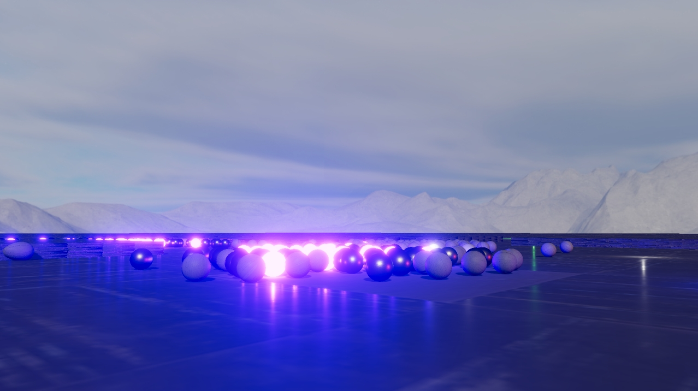
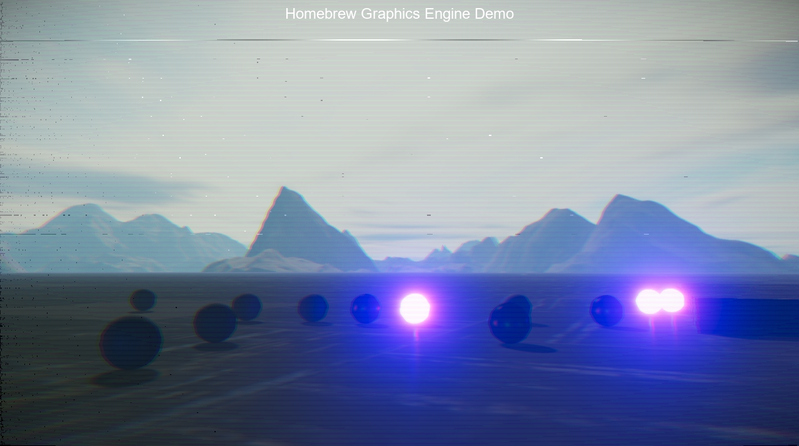

# HomebrewGraphicsEngine

A grahics/videogame engine writen in C++ using OpenGL.

## Features
- Collision and physics engine
- Deferred PBR shading with bloom
- Instanced rendering
- Font rendering
- Audio

## Screenshots

## Third-party libraries

- Asset-Importer-Lib (assimp)
- FreeType
- glad
- GLFW OpenGL Library
- Imgui
- OpenGL Mathematics (glm)
- KHR
- OpenAL soft
- stb
- AudioFile.h
- nlohmann/json

<a href="https://www.flaticon.com/free-icons/idea" title="idea icons">Idea icons created by Good Ware - Flaticon</a>
